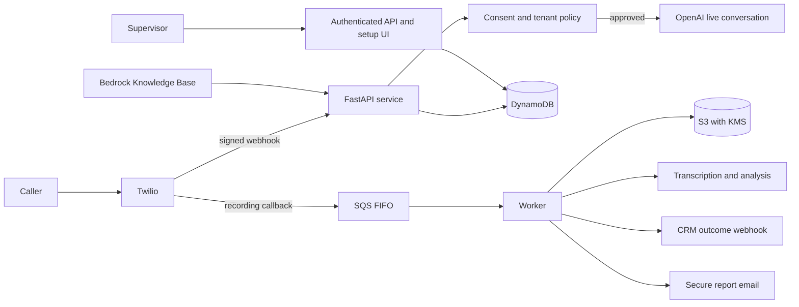

# Architecture

This project implements a multi-tenant voice and call-analysis pipeline. It uses Twilio for telephony, OpenAI for conversational and post-call analysis, AWS for storage and processing, and optional CRM, identity, billing, and knowledge integrations.

## Services

| Component | Responsibility |
| --- | --- |
| `app.py` | Serves Twilio webhooks, validates signatures, collects consent, maintains call turns, performs human handoff, and queues completed recordings. |
| `worker.py` | Downloads recordings, stores encrypted objects, transcribes, analyzes, creates call reports, updates CRM, and emails report links. |
| `aggregator.py` | Produces the scheduled master workbook from completed call records. |
| `dashboard.py` | Provides tenant-scoped supervisor call, metric, report-link, and erasure APIs. |
| `saas.py` | Stores organization profile, privacy approval, connection metadata, and onboarding status. |
| `integrations.py` | Handles OAuth authorization and callbacks for HubSpot, Salesforce, and Zoho. |
| `billing.py` | Starts Stripe subscription checkout and processes verified billing webhooks. |
| `knowledge.py` | Uploads tenant documents to encrypted S3, triggers Bedrock ingestion, and retrieves tenant-filtered context. |
| `core.py` | Centralizes PII redaction, tenant and policy checks, audit events, role claims, and data-retention expiry. |

## Trust Boundaries

- Twilio requests are accepted only after signature validation.
- Every telephone number maps to exactly one tenant policy.
- Dashboard endpoints require an authenticated token with `tenant_id`, `role`, and `sub` claims.
- S3 object paths begin with `tenants/{tenant_id}/`; dashboard queries use the tenant index.
- OAuth credentials are stored in AWS Secrets Manager, not DynamoDB.
- Transcript text is PII-redacted before it is sent to the AI analysis model. Raw transcript storage is disabled by default.

## Data Lifecycle

1. The incoming call is placed into `awaiting_consent`.
2. On affirmative consent, the service starts dual-channel recording and records consent evidence.
3. Twilio sends the completed-recording callback. A deterministic event key and FIFO deduplication prevent duplicate processing.
4. The worker stores the MP3, transcript payload, and workbook with SSE-KMS.
5. S3 lifecycle, DynamoDB TTL, and the erasure endpoint implement the configured lifecycle, subject to legal hold.

## Availability and Failure Handling

- Terraform self-hosting deploys the web service and worker as separate ECS services; the aggregator is scheduled separately by the operator.
- The worker queue has a five-attempt retry policy and a dead-letter queue.
- A non-empty DLQ raises an SNS alert.
- A call can transfer to the tenant escalation number when the caller requests a person, supervisor, or no further calls.
- The application intentionally fails closed when a required configuration value, tenant policy, or approval is missing.